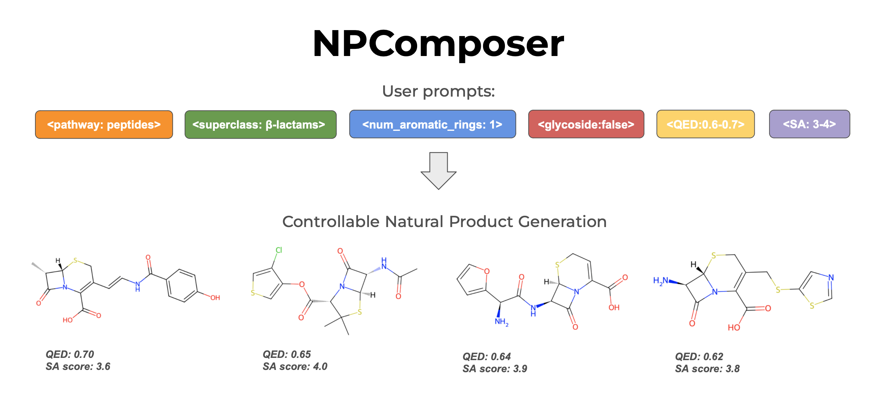
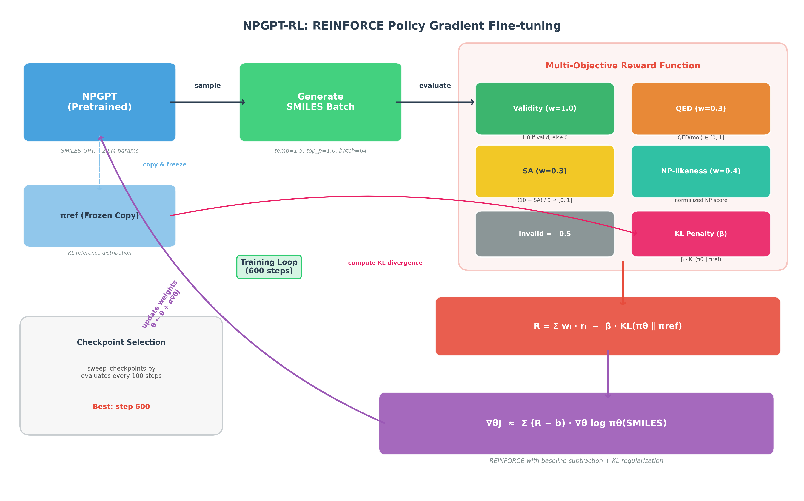

# NPComposer

A platform for training, evaluating, and comparing SMILES-based language models for natural product (NP) molecular generation. This project integrates multiple generative models with a unified evaluation pipeline, RL fine-tuning framework, and automated tooling for molecular analysis.


## Main Models

### NPComposer



NPComposer is a conditional molecular generation model trained by fine-tuning [GP-MoLFormer](https://huggingface.co/ibm-research/GP-MoLFormer-Uniq) — a 46.8M parameter transformer decoder foundation model — on the [COCONUT database](https://coconut.naturalproducts.net) containing over 700,000 experimentally validated natural products.

By providing class labels and molecular property information as special tokens during model fine-tuning, NPComposer allows for conditional natural product generation based on: NP biosynthesis pathway (7 pathways including Alkaloids, Terpenoids, Shikimates and Phenylpropanoids, etc.), NP superclass (70+ superclasses), presence or absence of glycoside, number of aromatic rings (0–22), QED drug-likeness (0–1), and synthetic accessibility score (1–10).

### NPGPT-RL



NPGPT-RL is an RL-finetuned version of [NPGPT](https://github.com/ohuelab/npgpt), a SMILES-based GPT model for unconditional molecular generation (~2.6M parameters). The pretrained NPGPT model is fine-tuned using the REINFORCE policy gradient algorithm with a multi-objective reward function that combines molecular validity (w=1.0), QED drug-likeness (w=0.3), synthetic accessibility (w=0.3, inverted), and NP-likeness (w=0.4), with a −0.5 penalty for invalid SMILES and KL regularization. A frozen copy of the pretrained model serves as a KL divergence reference to prevent mode collapse. Checkpoints are evaluated every 50 steps via sweep, with step 600 selected as the best checkpoint. The RL fine-tuning approach is based on [Thomas et al. (2025)](https://doi.org/10.1021/acs.jcim.5c02053).

### NPComposer-Drug (NP→Drug Generation)

NPComposer-Drug fine-tunes GP-MoLFormer using PEFT LoRA to generate drug-like analogs of natural products. Given a natural product SMILES as input, the model generates candidate molecules that preserve structural features of the source NP while shifting toward drug-like chemical space.

Training uses 380,000 COCONUT×ChEMBL pairs generated via FAISS Hamming search on Morgan fingerprints. Only ~885k parameters are trained (LoRA rank 16 on query/key/value projections, ~1.9% of the 47M backbone). The training format is `[CLS][NP_SMILES][UNK][drug_SMILES][SEP]` with loss computed only on drug tokens.

## Checkpoints

The NPComposer model is available on Hugging Face, and NPGPT checkpoints (pretrained + RL-finetuned) are on Google Drive:

[](https://huggingface.co/ralyn/NPComposer-v2)
[](https://drive.google.com/drive/u/0/folders/1N0qUxMJWN6szxo-HCSikyCip2FY2aSsg)

| Resource | Link |
|----------|------|
| NPComposer (HuggingFace) | https://huggingface.co/ralyn/NPComposer-v2/tree/main |
| NPGPT Checkpoints (Google Drive) | https://drive.google.com/drive/u/0/folders/1N0qUxMJWN6szxo-HCSikyCip2FY2aSsg |
| NPComposer-Drug LoRA checkpoint (Google Drive) | https://drive.google.com/file/d/1X_Au66rSYGc3Z4DDdHxkCNYana4CJVfd/view?usp=drive_link |


## Quick Start

```bash
# Full automated setup (dependencies + submodules + checkpoints + verification)
bash setup.sh

# Or with GPU support
bash setup.sh --gpu

# Or minimal setup via Make
make setup
```

`setup.sh` handles everything: Python dependencies, git submodules (npgpt, acegen-open, gp-molformer), checkpoint verification, NPClassifier setup, and directory structure creation. Run `bash setup.sh --help` for all options.


## Structure

```
NPComposer/
├── setup.sh                        # Full automated setup script
├── Makefile                        # Build automation (setup, data, eval, molecule gen)
├── conf/
│   ├── config.yaml                 # Hydra configuration
│   ├── train.yaml                  # Training configuration
│   └── inference.yaml              # Inference configuration
├── data/
│   ├── raw/                        # Original data (COCONUT, NPASS)
│   ├── processed/                  # Filtered subsets + training_data.csv
│   └── splits/                     # Train/Val/Test splits
├── src/
│   ├── training/
│   │   ├── train.py                # NPComposer fine-tuning
│   │   ├── train_np_drug_pairs.py  # NP→drug LoRA pair-tuning
│   ├── inference/
│   │   ├── inference.py            # NPComposer conditional generation
│   │   └── infer_np_drug.py        # NP→drug inference (single SMILES or batch CSV)

│   ├── npgpt-rl/
│   │   ├── train_rl.py             # REINFORCE RL fine-tuning for NPGPT
│   │   ├── reward.py               # Multi-objective reward (validity + QED + SA + NP-likeness)
│   │   ├── compare_models.py       # Pretrained vs RL model comparison
│   │   └── sweep_checkpoints.py    # Checkpoint sweep evaluation
│   ├── evaluation/
│   │   ├── evaluate.py             # Unified evaluation (NPGPT + GP-MoLFormer)
│   │   ├── evaluate_shawn.py       # NPComposer evaluation (7 pathway + optimal configs)
│   │   ├── eval_np_drug_pairs.py   # NP→drug evaluation (recovery rate, Tanimoto metrics)
│   │   ├── compare_all_models.py   # Cross-model comparison bar chart
│   │   ├── compute_metrics.py      # Standalone metrics computation
│   │   └── make_plots.py           # Plot generation utilities
│   └── data_preprocessing/
│       ├── bin_cont_variables.py   # QED/SA bin definitions for conditioning tokens
│       ├── rdkit_metrics.py        # RDKit-based molecular property calculations
│       ├── stratified_train_split.py  # Stratified train/val/test splitting
│       └── np_drug/
│           ├── clean_coconut_npdrug.py   # COCONUT cleaning for NP→drug pipeline
│           ├── clean_ChEMBL.py           # ChEMBL cleaning for NP→drug pipeline
│           ├── generate_ChEMBL_pairs.py  # FAISS-based NP×drug pair generation
│           ├── build_faiss_index.py      # Build FAISS binary index from fingerprints
│           ├── morgan_fingerprints.py    # Packed uint8 Morgan fingerprint utilities
│           └── bin_cont_variables_npdrug.py  # Property binning for NP→drug pairs
├── scripts/
│   ├── make_molecule.py            # Single molecule generation + visualization
│   ├── create_subset.py            # K-means subset creation in Tanimoto space
│   ├── merge_training.py           # Merge COCONUT + NPASS into training_data.csv
│   ├── merge_npass.py              # Merge NPASS TSV files
│   ├── split_data.py               # Train/val/test splitting
│   ├── clean_npdrug.py             # NP-Drug dataset cleaning
│   ├── analyze_distribution.py     # Raw vs processed distribution comparison
│   ├── analyze_sdf.py              # SDF file analysis
│   ├── download_data.sh            # COCONUT download
│   ├── download_npass.sh           # NPASS download
│   └── download_np_drug.sh         # NP-Drug download
├── external/
│   ├── npgpt/                      # NPGPT baseline (git submodule)
│   ├── gp-molformer/               # GP-MoLFormer baseline (git submodule)
│   └── acegen-open/                # AceGen RL framework (git submodule)
├── tests/                          # pytest test suite
├── requirements.txt
└── npcomposer.def                  # Apptainer container definition
```


## Model Evaluation

The evaluation system compares 4 models across multiple configurations with standardized metrics.

### Models

| Model | Type | Conditioning | Script |
|-------|------|-------------|--------|
| NPGPT (Pretrained) | Unconditional baseline | None | `evaluate.py npgpt` |
| NPGPT (RL-finetuned) | RL-optimized | None (reward: QED+SA+NP+validity) | `evaluate.py npgpt-rl` |
| GP-MoLFormer | Foundation model baseline | None | `evaluate.py gpmolformer` |
| NPComposer (QED+SA) | Conditional generation | `<qed_bin:0.9<=qed<1><sa_bin:1<=sa<2>` | `evaluate_shawn.py` |
| NPComposer (per-pathway) | Conditional + pathway | `<np_classifier_pathway:X><qed_bin:...><sa_bin:...>` | `evaluate_shawn.py` |

NPComposer evaluation supports all 7 NPClassifier pathways: Alkaloids, Amino acids and Peptides, Carbohydrates, Fatty acids, Polyketides, Shikimates and Phenylpropanoids, and Terpenoids.

### Metrics

| Metric | Definition | Range |
|--------|-----------|-------|
| Validity | Fraction of valid SMILES (sanitization-based: parse/valence/kekulize checks) | 0–1 |
| QED | Drug-likeness score | 0–1 (higher = better) |
| SA Score | Synthetic accessibility | 1–10 (lower = better) |
| NP-likeness | Natural product likeness | ~-3 to +3 (higher = more NP-like) |
| Internal Diversity | Mean pairwise Tanimoto similarity (Morgan FP, r=2, 2048 bits) | 0–1 (lower = more diverse) |
| Uniqueness | Fraction not in training set (NPGPT only) | 0–1 |
| Novelty | Fraction with NN Tanimoto < 0.4 to reference set (NPGPT only) | 0–1 |
| Pathway Accuracy | NPClassifier classification accuracy vs conditioning token (NPComposer, `--classify`) | 0–1 |

### Running Evaluations

```bash
# Individual models
python src/evaluation/evaluate.py npgpt-rl          # NPGPT pretrained vs RL
python src/evaluation/evaluate.py gpmolformer        # GP-MoLFormer

# NPComposer (all 8 configs: 1 optimal + 7 pathways)
python src/evaluation/evaluate_shawn.py

# NPComposer pathway classification only (skip optimal_params)
python src/evaluation/evaluate_shawn.py --classify

# NPComposer specific configs
python src/evaluation/evaluate_shawn.py --configs pathway_alkaloid pathway_terpenoid

# Cross-model comparison (bar chart)
python src/evaluation/compare_all_models.py
python src/evaluation/compare_all_models.py --ref_model "NPGPT (RL)"
python src/evaluation/compare_all_models.py --pairs all

# Via Make
make eval-all              # Run everything + comparison
make eval-npgpt-rl         # NPGPT pretrained vs RL only
make eval-gpmolformer      # GP-MoLFormer only
make eval-npcomposer       # NPComposer only
make eval-compare          # Comparison plot only
```

Each evaluation generates per-seed JSON results, 2x3 histograms (validity / QED / SA / NP-likeness / error breakdown / summary), and aggregate statistics. The `--classify` flag enables NPClassifier API calls to measure pathway adherence accuracy and produces a combined accuracy + predicted distribution chart.

### Configuration

All evaluations default to 3 seeds x 50 molecules per seed. Override via CLI:

```bash
python src/evaluation/evaluate.py npgpt-rl --seeds 1 2 3 4 5 --n_samples 100 --temperature 1.5
python src/evaluation/evaluate_shawn.py --configs optimal_params pathway_alkaloid --n_samples 100
```


## Molecule Generation

Generate a single valid molecule with RDKit visualization:

```bash
# Via Make (recommended)
make molecule MODEL=npgpt
make molecule MODEL=npgpt-rl
make molecule MODEL=gpmolformer

# NPComposer with pathway conditioning
make molecule MODEL=npcomposer PROMPT="<np_classifier_pathway:Alkaloids>"
make molecule MODEL=npcomposer PROMPT="<np_classifier_pathway:Amino acids and Peptides>"
make molecule MODEL=npcomposer PROMPT="<np_classifier_pathway:Fatty acids>"
make molecule MODEL=npcomposer PROMPT="<np_classifier_pathway:Terpenoids>"

# Direct script
python scripts/make_molecule.py npgpt-rl --temperature 1.5
python scripts/make_molecule.py npcomposer --prompt "<np_classifier_pathway:Alkaloids>"
python scripts/make_molecule.py npcomposer --prompt "<np_classifier_pathway:Amino acids and Peptides>"
python scripts/make_molecule.py npcomposer --prompt "<np_classifier_pathway:Fatty acids>"
```

The script retries until a valid SMILES is produced (up to 50 attempts), saves a PNG image, displays it (iTerm2 inline / Kitty / sixel / macOS Preview), and prints the canonical SMILES.


## RL Fine-tuning (NPGPT)

NPGPT is fine-tuned with REINFORCE policy gradient to optimize a multi-objective reward combining validity, QED, SA (inverted: lower raw SA = higher reward), and NP-likeness.

```bash
python src/npgpt-rl/train_rl.py \
    --orig_ckpt src/npgpt-rl/npgpt.ckpt \
    --w_validity 1.0 --w_qed 0.3 --w_sa 0.3 --w_np_likeness 0.4

# Sweep checkpoints to find best step
python src/npgpt-rl/sweep_checkpoints.py

# Compare pretrained vs RL
python src/npgpt-rl/compare_models.py
```

Reward function (in `reward.py`):

| Component | Weight | Formula |
|-----------|--------|---------|
| Validity | 1.0 | 1.0 if valid SMILES, else penalty |
| QED | 0.3 | QED score [0, 1] |
| SA | 0.3 | (10 - raw_SA) / 9 → [0, 1] where 1 = easiest |
| NP-likeness | 0.4 | Normalized NP score |
| Invalid penalty | -0.5 | Applied to unparseable SMILES |


## Conditioning Tokens

NPComposer uses special tokens as conditioning prompts during generation. All available tokens are defined in the model's `special_tokens_map.json`:

| Token Type | Example | Count |
|------------|---------|-------|
| Pathway | `<np_classifier_pathway:Alkaloids>` | 7 |
| Superclass | `<np_classifier_superclass:Flavonoids>` | 70+ |
| Glycoside | `<np_classifier_is_glycoside:True>` | 2 |
| Aromatic rings | `<aromatic_rings_count:3>` | 22 (0–22) |
| QED bin | `<qed_bin:0.9<=qed<1>` | 10 (0.0–1.0, step 0.1) |
| SA bin | `<sa_bin:1<=sa<2>` | 9 (1.0–10.0, step 1.0) |

Multiple tokens can be combined in a single prompt:

```python
# Example: Generate alkaloid with high QED and low SA
prompt = "<np_classifier_pathway:Alkaloids><qed_bin:0.9<=qed<1><sa_bin:1<=sa<2>"
```

All 7 NPClassifier pathways:

```
Alkaloids, Amino acids and Peptides, Carbohydrates, Fatty acids,
Polyketides, Shikimates and Phenylpropanoids, Terpenoids
```


## NP→Drug Pipeline

NPComposer-Drug learns to generate drug-like analogs of natural products via pair-tuning on COCONUT×ChEMBL molecule pairs.

### Data Preparation

```bash
make clean-coconut-npdrug   # Clean COCONUT (standardize columns, compute SA score)
make clean-chembl-npdrug    # Clean ChEMBL drug subset
make generate-pairs         # FAISS Hamming search → ~380k NP×drug pairs
# Or run all three:
make pipeline-np-drug
```

Pairs are generated by encoding both datasets as packed uint8 Morgan fingerprints (ECFP4, 2048 bits), building a FAISS `IndexBinaryFlat` over ChEMBL, and querying each COCONUT NP for its nearest ChEMBL neighbors by Tanimoto similarity.

### Training (LoRA)

```bash
make train-np-drug-lora                                    # rank 16, 50 epochs, lr 1e-4
make train-np-drug-lora LORA_RANK=32 TRAIN_EPOCHS=100      # custom settings
```

### Evaluation

```bash
make eval-np-drug-lora    # synthetic test pairs (Tanimoto recovery at 0.3/0.4/0.5/0.6)
make eval-np-drug-real    # real validated NP→drug pairs (data/processed/np_drug.csv)
```

| Metric | Definition |
|--------|-----------|
| Validity | % generated SMILES that parse |
| Uniqueness | unique valid / total valid |
| Mean QED | drug-likeness of generated molecules |
| Tanimoto → source | structural similarity to input NP |
| Tanimoto → target | structural similarity to known paired drug |
| Recovery rate | % test NPs where best candidate Tanimoto ≥ threshold (0.3/0.4/0.5/0.6) |

### Inference

```bash
# Single NP SMILES
make infer-np-drug SMILES="CC1=CC2=C(C=C1)C(=O)C3=CC=CC=C3C2=O"

# Batch from CSV
python src/evaluation/infer_np_drug.py \
    --checkpoint models/np_drug_lora_r16/final \
    --input-csv  data/my_nps.csv \
    --lora --k 25 --output-csv results/candidates.csv
```

### Make Targets

```bash
make pipeline-np-drug               # Clean COCONUT + ChEMBL + generate pairs
make train-np-drug-lora             # Train LoRA model
make eval-np-drug-lora              # Eval on synthetic test pairs
make eval-np-drug-real              # Eval on real NP→drug pairs
make infer-np-drug SMILES="CCO..."  # Generate candidates for a single NP
```


## Data Pipeline

```
Raw Data (COCONUT 715K / NPASS 203K)
    ↓ Valid SMILES filter
    ↓ Atom count filter (≤ 150)
    ↓ Ring count filter (≤ 10)
    ↓ SA filter (≤ 6.0)
    ↓ Tanimoto space embedding (FP → PCA 3D)
    ↓ K-means clustering (Tanimoto FP + SA/QED/NPL)
    ↓ NPClassifier superclass labeling
Subset (100K each) → Merge → training_data.csv → Train/Val/Test (seed=42)
```

```bash
make download-all       # Download COCONUT + NPASS + NP-Drug
make pipeline-all       # Process everything
make all                # setup → download → pipeline → test
```


## NPClassifier

Pathway classification uses the [NPClassifier UCSD API](https://npclassifier.ucsd.edu) — no local installation needed. Enable it with the `--classify` flag during NPComposer evaluation:

```bash
# Classify all 7 pathways (skips optimal_params automatically)
python src/evaluation/evaluate_shawn.py --classify

# Classify specific pathways
python src/evaluation/evaluate_shawn.py --classify --configs pathway_alkaloid pathway_terpenoid
```

This generates a 2-panel chart: pathway classification accuracy (left) and predicted pathway distribution (right).


## Apptainer

```bash
make apptainer          # Build container
make shell              # Interactive shell
apptainer exec --bind ./data:/app/data npcomposer.sif make pipeline-coconut
```


## Testing

```bash
make test               # All tests
make test-quick         # Skip slow tests
```


## Make Targets

```bash
make help               # Show all available targets
make setup              # Install dependencies
make eval-all           # Run all evaluations + comparison
make eval-npgpt-rl      # NPGPT pretrained vs RL
make eval-gpmolformer   # GP-MoLFormer
make eval-npcomposer    # NPComposer (all configs)
make eval-compare       # Cross-model comparison chart
make molecule MODEL=X   # Generate & visualize a single molecule
make pipeline-all       # Full data pipeline
make download-all       # Download all datasets
make test               # Run pytest suite
make clean              # Remove generated artifacts
```


## Dataset Sources

COCONUT (COlleCtion of Open Natural prodUcTs): ~715K molecules. Source: https://coconut.naturalproducts.net. Reference: Sorokina et al., J. Cheminform., 2021.

NPASS (Natural Product Activity and Species Source Database): ~203K molecules. Source: https://bidd.group/NPASS/. Reference: Zeng et al., Nucleic Acids Res., 2018.

NP-Drug: ~3K natural products with known drug activity for downstream evaluation.


## References

This project builds upon and integrates the following works. If you use NPComposer, please cite the relevant papers:

### GP-MoLFormer (Foundation Model)

NPComposer is fine-tuned from GP-MoLFormer, a 46.8M parameter autoregressive transformer decoder for molecular generation.

```bibtex
@article{ross2024gpmolformer,
  title={GP-MoLFormer: A Foundation Model For Molecular Generation},
  author={Ross, Jerret and Belgodere, Brian and Hoffman, Samuel C and Chenthamarakshan, Vijil and Mroueh, Youssef and Das, Payel},
  journal={arXiv preprint arXiv:2405.04912},
  year={2024}
}
```

### NPGPT (Baseline Model)

NPGPT is the SMILES-based GPT model used as the unconditional baseline and RL fine-tuning target.

```bibtex
@article{sakano2025npgpt,
  title={NPGPT: Natural Product-Like Compound Generation with GPT-based Chemical Language Models},
  author={Sakano, Kengo and Furui, Katsuhiko and Ohue, Masahito},
  journal={The Journal of Supercomputing},
  volume={81},
  pages={1--20},
  year={2025},
  publisher={Springer}
}
```

### SMILES-GPT (Tokenizer & Architecture)

SMILES-GPT provides the GPT-2 tokenizer and base transformer architecture used by NPGPT.

```bibtex
@article{adilov2021smilesgpt,
  title={Generative Pre-Training from Molecules},
  author={Adilov, Sanjar},
  journal={ChemRxiv Preprint},
  year={2021},
  doi={10.26434/chemrxiv-2021-5fwjd}
}
```

### AceGen (RL Framework Reference)

AceGen was referenced as an RL framework for applying policy gradient methods to chemical language models.

```bibtex
@article{bou2024acegen,
  title={ACEGEN: Reinforcement Learning of Generative Chemical Agents for Drug Discovery},
  author={Bou, Albert and Thomas, Morgan and Dittert, Sebastian and Navarro, Carles and Majewski, Maciej and Wang, Ye and Patel, Shivam and Tresadern, Gary and Ahmad, Mazen and Moens, Vincent and others},
  journal={Journal of Chemical Information and Modeling},
  volume={64},
  number={15},
  pages={5900--5911},
  year={2024},
  publisher={ACS Publications},
  doi={10.1021/acs.jcim.4c00895}
}
```

### REINFORCE-ING CLMs (RL Algorithm Reference)

The REINFORCE policy gradient algorithm and its practical components (baseline subtraction, reward shaping, KL regularization) for chemical language models were referenced from this work.

```bibtex
@article{thomas2025reinforcing,
  title={REINFORCE-ING Chemical Language Models for Drug Discovery},
  author={Thomas, Morgan and Bou, Albert and G{\'o}mez-Tamayo, Jose Carlos and Tresadern, Gary and Ahmad, Mazen and De Fabritiis, Gianni},
  journal={Journal of Chemical Information and Modeling},
  volume={65},
  pages={12752--12763},
  year={2025},
  publisher={ACS Publications},
  doi={10.1021/acs.jcim.5c02053}
}
```

### NPClassifier (Pathway Classification)

NPClassifier is used via its public API for pathway classification accuracy evaluation.

```bibtex
@article{kim2021npclassifier,
  title={NPClassifier: A Deep Neural Network-Based Structural Classification Tool for Natural Products},
  author={Kim, Hyun Woo and Wang, Mingxun and Leber, Christopher A and Nothias, Louis-F{\'e}lix and Reher, Raphael and Kang, Kyo Bin and van der Hooft, Justin JJ and Dorrestein, Pieter C and Gerwick, William H and Cottrell, Garrison W},
  journal={Journal of Natural Products},
  volume={84},
  number={11},
  pages={2795--2807},
  year={2021},
  publisher={ACS Publications},
  doi={10.1021/acs.jnatprod.1c00399}
}
```


## Third-Party Licenses

This project includes code from the following open-source projects: [NPGPT](https://github.com/ohuelab/npgpt) (MIT), [SMILES-GPT](https://github.com/sanjaradylov/smiles-gpt) (Clear BSD), [GP-MoLFormer](https://github.com/IBM/gp-molformer) (Apache 2.0), [AceGen](https://github.com/Acellera/acegen-open) (MIT), and [NP-Classifier](https://github.com/mwang87/NP-Classifier) (MIT). See [THIRD_PARTY_LICENSES](THIRD_PARTY_LICENSES) for full license texts.
